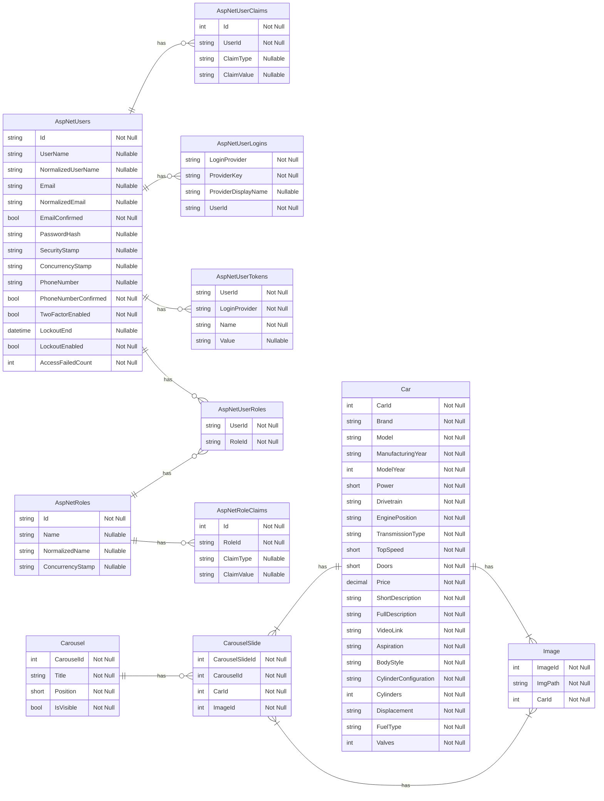

<h1>Car Query</h1>

Sistema para consulta, gerenciamento e exibição de carros, com funcionalidades para usuários e administradores

<h2>Índice</h2>
<ul>
  <li><a href="#sobre-o-sistema">Sobre o sistema</a></li>
  <li><a href="#tecnologias-utilizadas">Tecnologias utilizadas</a></li>
  <li><a href="#modelo-de-dados">Modelo de dados</a></li>
  <li><a href="#funcionalidades">Funcionalidades (com gifs)</a></li>
</ul>

<h2 id="sobre-o-sistema">Sobre o sistema</h2>

Car Query é uma aplicação web que desenvolvi para desenvolver minhas habilidades em C# e ASP.NET Core.

  O sistema permite consultar informações dos carros cadastrados no sistema, tais como potência, ano de modelo e de fabricação, aspiração, transmissão, tração e outras informações, 
  bem como visualizar imagens e um vídeo sobre o carro.

  O Car Query também disponibiliza uma pesquisa filtrada, onde o usuário pode pesquisar por marca, potênica, ano e preço, sendo possível especificar um intervalo nos campos numéricos, 
como potência mínima e potência máxima.

  Os veículos podem ser cadastrados e gerenciados através de contas de "Admin" e de "SuperAdmin". O usuário SuperAdmin é o usuário de maior hierarquia do sistema, além de poder gerenciar
  carros e os carrosséis exibidos na página inicial, ele também gerencia os usuários. Somente o SuperAdmin pode cadastrar novos administradores, ou seja perfil do tipo "Admin", perfil este que 
  autoriza o gerenciamento dos carros e carrosséis.

<h2 id="tecnologias-utilizadas">Tecnologias utilizadas</h2>

* 
* 
* 
* 
* 
* 

<h2 id="modelo-de-dados">Modelo de dados</h2>

<!--
    Relações no Mermaid:
    ||--|| = um para um
    ||--o{  = um para zero-ou-muitos
   
    || = exatamente um (chave estrangeira faz parte da chave primária da tabela dependente. Dependência forte)
    }o = zero ou um
    }| = exatamente um (chave estrangeira é apenas um campo comum, não faz parte de PK. Dependência fraca)
    o{ = zero ou muitos
    |{ = um ou muitos
--->

<h2 id="funcionalidades">Funcionalidades</h2>
<h3>Usuário comum</h3>

* <h4>Responsividade</h4>

  
O layout do sistema se adapta para dispositivos mobile e desktop

  

* <h4>Visualizar carrosséis</h4>

  
O usuário pode visualizar e interagir com os carrosséis apresentados na tela inicial

  

* <h4>Pesquisar veículos</h4>

  
O usuário pode pesquisar veículos por marca ou modelo

  

* <h4>Visualizar informações dos veículos</h4>

  
O usuário pode visualizar informações do veículo selecionado

  

* <h4>Pesquisa filtrada de veículos</h4>

  
O usuário pode realizar pesquisas com filtros, podendo especificar a marca, bem como o intervalo de ano do modelo, potência e preço.

  

* <h4>Enviar feedback</h4>

  
O usuário pode enviar feedbacks para a equipe gestora do sistema. Os feedbacks podem ser conferidos pela equipe gestora no @@@@@@@@@@@@

  

<h3>Administrador (Admin)</h3>

* <h4>Login</h4>

  
Os administradores podem realizar login para acessar a página de administração do site

  

* <h4>Adicionar carro</h4>

  
Os administradores podem adicionar novos carros no sistema, preenchendo suas infromações técnicas e adicionando imagens e um vídeo do youtube

  

* <h4>Listar carros</h4>

  
O sistema lista todos os carros cadastrados no sistema, disponibilizando um campo para pesquisa e as operações de gerência de carros

  

* <h4>Editar carro</h4>

  
Os administradores podem atualizar ou corrigir os dados dos veículos

  

* <h4>Deletar carro</h4>

  
Os administradores podem deletar carros do sistema

  

* <h4>Carrosséis</h4>

  
Para permitir que o site ficasse mais dinâmico, criei um sistema de carrosséis para que os administradores possam alterar as apresentações da tela inicial.

  
Um carrossel é um conjunto de slides contendo um carro cada, que são exibidos na tela inicial do sistema. Cada    carrossel possui um título e uma lista de veículos. 
  Um carrossel pode estar habilitado ou desabilitado. Caso esteja habilitado, ele é exibido na página inicial, do contrário ele continua no sistema mas não é exibido.
  Cada carrossel possui uma posição que indica a ordem que serão exibidas na tela inicial.

* <h4>Adicionar carrossel</h4>

  

    O sistema permite a criação carrosséis que são exibidos na tela inicial, permitindo que os administradores adicionem um título, selecionem os carros e suas imagens para serem exibidos no carrossel.
    Cada carro é exibido em um slide diferente
  

  

* <h4>Listar carrosséis</h4>

  
O sistema lista todos os carrosséis cadastrados no sistema, disponibilizando um campo para busca dos carrosséis (por título) e disponibilizando as operações de gerência de carrosséis

  

* <h4>Editar carrossel</h4>

  
Os administradores podem atualizar ou corrigir dados dos carrosséis, podendo alterar os veículos apresentados no carrossel, seu título, se está habilitado ou desabilitado e alterar a posição do carrossel.

  

* <h4>Deletar carrossel</h4>

  
Os administradores podem deletar carrosséis

  

<h3>Super administrador (SuperAdmin)</h3>

Além de ter acesso a todas as operações do Admin, possui as seguintes permissões

* <h4>Registrar novo administrador</h4>

  
O super administrador pode registrar novos administradores

  

* <h4>Listar administradores</h4>

  
O super administrador pode visualizar todos os administradores cadastrados no sistema

  

* <h4>Editar administrador</h4>

  
O super administrador pode atualizar as informações das contas "Admin"

  

* <h4>Deletar administrador</h4>

  
O super administrador pode deletar contas de administradores

  

